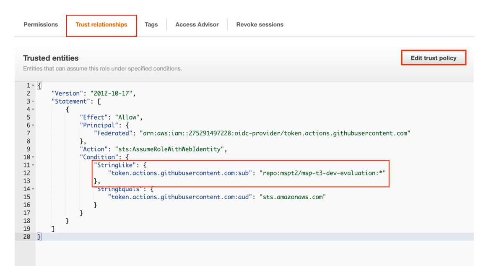
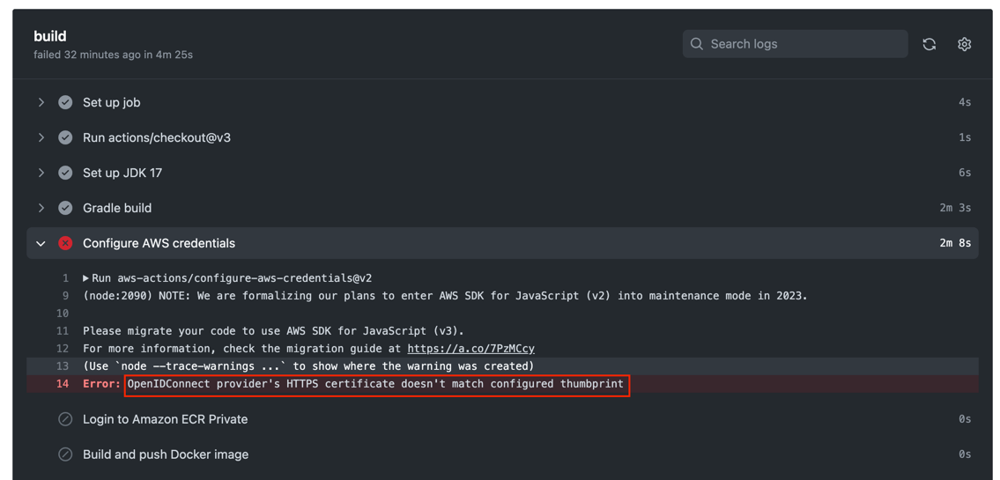
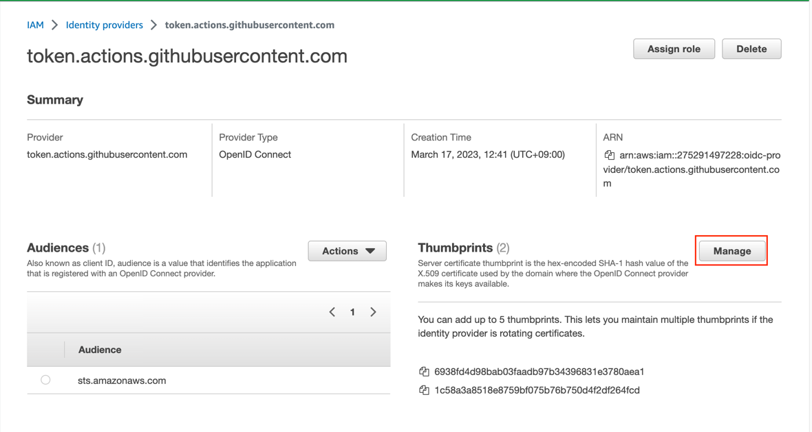
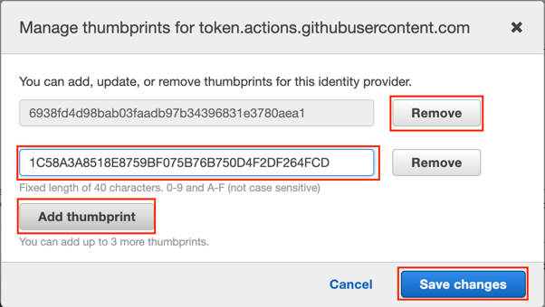

# Github Actions로 CI pipeline 구성하기

## 주요 과정

1. ~~evaluation-api 또는 evaluation-event 내부의 파일이 변경되는 main branch의 push가 될 경우~~
2. evaluation-api 또는 evaluation-event 디렉토리에서 gradlew build 실행
3. AWS ECR repository로 로그인 한 후 docker build-and-push 진행

## Github Actions에서 aws credential 사용하기

1. AWS IAM 콘솔의 Identity providers에서 token.actions.githubusercontent.com으로 OpenID Connect 생성


| 항목            | 값                                           |
|---------------|---------------------------------------------|
| Provider type | OpenID Connect                              |
| Provider URL  | https://token.actions.githubusercontent.com |
| Audience      | sts.amazonaws.com                           |


2. Github Actions에서 사용할 Role 생성


Code

```json
{
    "Version": "2012-10-17",
    "Statement": [
        {
            "Sid": "AllowPushPull",
            "Effect": "Allow",
            "Action": [
                "ecr:BatchGetImage",
                "ecr:BatchCheckLayerAvailability",
                "ecr:CompleteLayerUpload",
                "ecr:GetDownloadUrlForLayer",
                "ecr:InitiateLayerUpload",
                "ecr:PutImage",
                "ecr:UploadLayerPart"
            ],
            "Resource": [
                "arn:aws:ecr:<<ecr-region>>:<<ecr-account>>:repository/evaluation-api",
                "arn:aws:ecr:<<ecr-region>>:<<ecr-account>>:repository/evaluation-event"
            ]
        },
        {
            "Sid": "AllowEcrLogin",
            "Effect": "Allow",
            "Action": [
                "ecr:GetAuthorizationToken"
            ],
            "Resource": [
                "*"
            ]
        }
    ]
}
```


생성한 role의 arn 값을 github actions에서 사용한다.

만약 해당 role을 특정 repository와 특정 브랜치에서만 사용하도록 구성하고자 한다면 

Trust relationships 탭에서 다음과 같이 sub 항목을 추가한다.

```json
{
    "Version": "2012-10-17",
    "Statement": [
        {
            "Effect": "Allow",
            "Principal": {
                "Federated": "arn:aws:iam::<<aws-user-id>>:oidc-provider/token.actions.githubusercontent.com"
            },
            "Action": "sts:AssumeRoleWithWebIdentity",
            "Condition": {
                "StringLike": {
                    "token.actions.githubusercontent.com:sub": "repo:<<user>>/<<repo-name>>:*"
                },
                "StringEquals": {
                    "token.actions.githubusercontent.com:aud": "sts.amazonaws.com"
                }
            }
        }
    ]
}

```



## github actions workflow

.github/workflows 하위의 두 파일을 확인
- [api-ci.yml](api-ci.yml)
- [event-ci.yml](event-ci.yml)

workflow 실행

Actions > workflow 선택 > Run workflow


## troubleshooting

`OpenIDConnect provider's HTTPS certificate doesn't match configured thumbprint` 에러가 발생한 경우

token.actions.githubusercontent.com의 thumbprint가 변경되어서 발생된다.



thumbprint를 찾아서 AWS IAM Identity provider를 수정해 주면 된다.

우선 thumbprint를 찾는다.

:link: https://docs.aws.amazon.com/ko_kr/IAM/latest/UserGuide/id_roles_providers_create_oidc_verify-thumbprint.html

githubusercontent의 OIDC idP URL에서 정보를 찾는다.

```bash
curl https://token.actions.githubusercontent.com/.well-known/openid-configuration

{"issuer":"https://token.actions.githubusercontent.com","jwks_uri":"https://token.actions.githubusercontent.com/.well-known/jwks","subject_types_supported":["public","pairwise"],"response_types_supported":["id_token"],"claims_supported":["sub","aud","exp","iat","iss","jti","nbf","ref","repository","repository_id","repository_owner","repository_owner_id","run_id","run_number","run_attempt","actor","actor_id","workflow","workflow_ref","workflow_sha","head_ref","base_ref","event_name","ref_type","environment","environment_node_id","job_workflow_ref","job_workflow_sha","repository_visibility","runner_environment"],"id_token_signing_alg_values_supported":["RS256"],"scopes_supported":["openid"]}
```

이 중 jwks_uri의 도메인 주소를 복사해 둔다.
`token.actions.githubusercontent.com`

openSSL 명령을 이용하여 아래 명령을 실행한다.

```bash
openssl s_client -servername token.actions.githubusercontent.com -showcerts -connect token.actions.githubusercontent.com:443

...
 1 s:/C=US/O=DigiCert Inc/CN=DigiCert TLS RSA SHA256 2020 CA1
   i:/C=US/O=DigiCert Inc/OU=www.digicert.com/CN=DigiCert Global Root CA
-----BEGIN CERTIFICATE-----
MIIEvjCCA6agAwIBAgIQBtjZBNVY...
-----END CERTIFICATE-----
...
```

여러 인증서가 나오지만 끝 쪽에서 Root CA로 보이는 인증서가 등장한다.

`-----BEGIN CERTIFICAT-----`로 시작해서 `-----END CERTIFICATE-----`로 끝나는 부분까지 복사한 다음

`cert.crt` 파일로 저장한다.

```bash
vi cert.crt
복사한 인증서 붙여넣고 저장
```

다음 명령어를 실행하여 thumbprint를 생성한다.

```bash
openssl x509 -in cert.crt -fingerprint -sha1 -noout | sed -e 's/://g'

SHA1 Fingerprint=1C58A3A8518E8759BF075B76B750D4F2DF264FCD
```

SHA1 Fingerprint 값으로 나오는 `1C58A3A8518E8759BF075B76B750D4F2DF264FCD` 문자열을 복사한 다음

AWS IAM Identity providers에서 token.actions.githubusercontent.com idP에서 Thumbprints의 Manage 버튼을 클릭한다.



기존 thumbprint는 5개가 넘는다면 지워도 무방하다.

Add thumbprint를 클릭한 후 복사한 문자열을 입력한 다음 Save changes를 클릭한다.

