# Github Actions로 CI pipeline 구성하기

## 주요 과정

1. evaluation-api 또는 evaluation-event 내부의 파일이 변경되는 main branch의 push가 될 경우
2. evaluation-api 또는 evaluation-event 디렉토리에서 gradlew build 실행
3. AWS ECR repository로 로그인 한 후 docker build-and-push 진행

## Github Actions에서 aws credential 사용하기

1. AWS IAM 콘솔의 Identity providers에서 token.actions.githubusercontent.com으로 OpenID Connect 생성

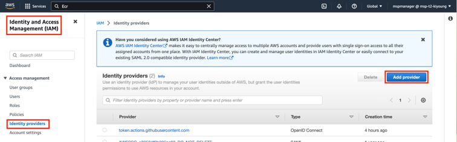

| 항목            | 값                                           |
|---------------|---------------------------------------------|
| Provider type | OpenID Connect                              |
| Provider URL  | https://token.actions.githubusercontent.com |
| Audience      | sts.amazonaws.com                           |

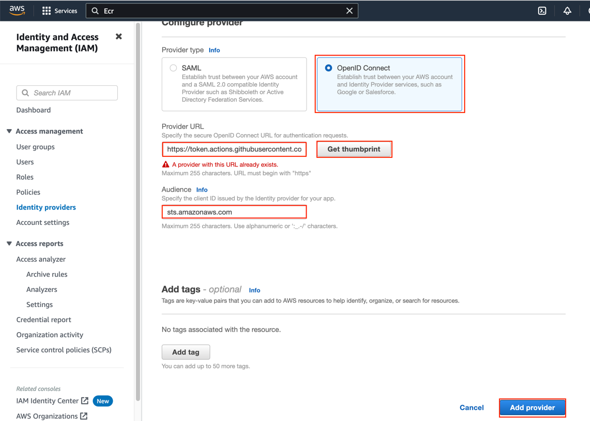

2. Github Actions에서 사용할 Role을 생성합니다.

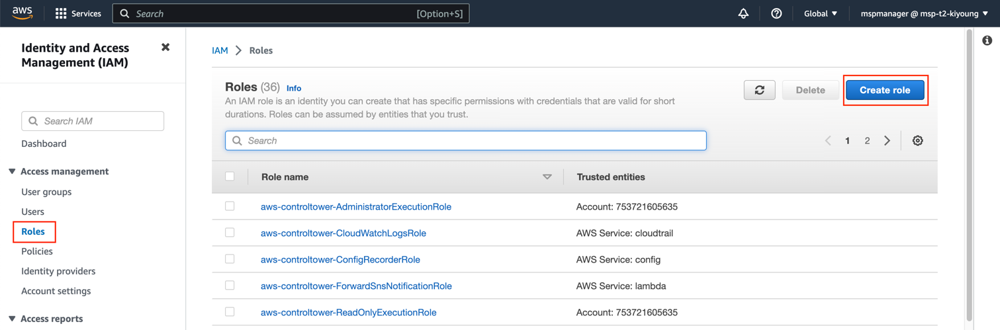

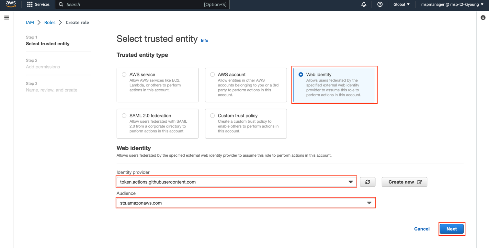

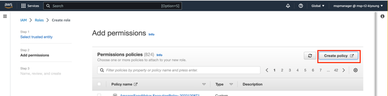

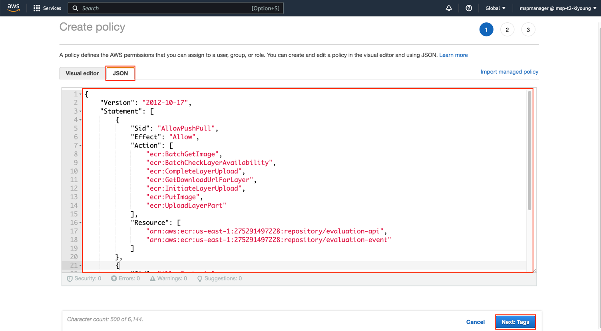

Code

```json
{
    "Version": "2012-10-17",
    "Statement": [
        {
            "Sid": "AllowPushPull",
            "Effect": "Allow",
            "Action": [
                "ecr:BatchGetImage",
                "ecr:BatchCheckLayerAvailability",
                "ecr:CompleteLayerUpload",
                "ecr:GetDownloadUrlForLayer",
                "ecr:InitiateLayerUpload",
                "ecr:PutImage",
                "ecr:UploadLayerPart"
            ],
            "Resource": [
                "arn:aws:ecr:us-east-1:<<ecr-account>>:repository/evaluation-api",
                "arn:aws:ecr:us-east-1:<<ecr-account>>:repository/evaluation-event"
            ]
        },
        {
            "Sid": "AllowEcrLogin",
            "Effect": "Allow",
            "Action": [
                "ecr:GetAuthorizationToken"
            ],
            "Resource": [
                "*"
            ]
        }
    ]
}
```

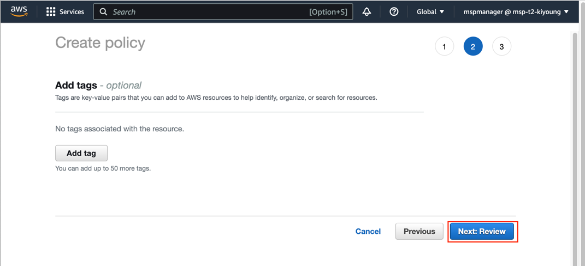

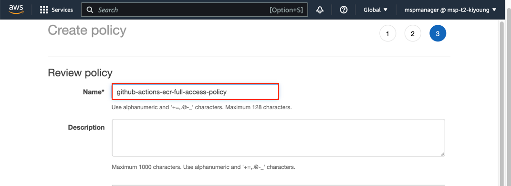

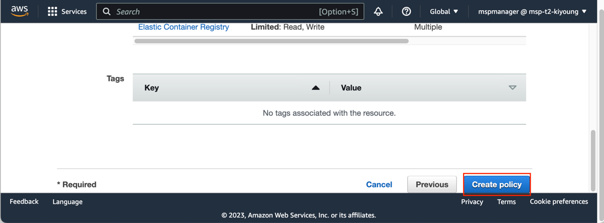

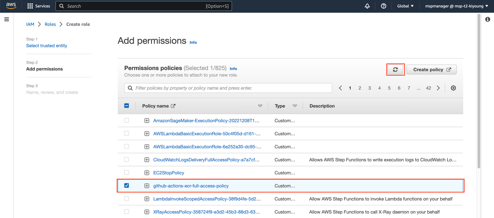

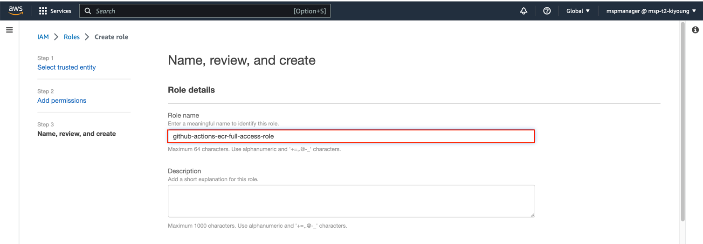

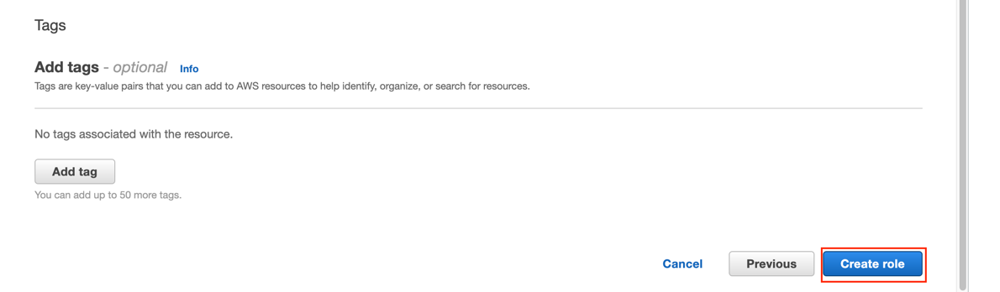

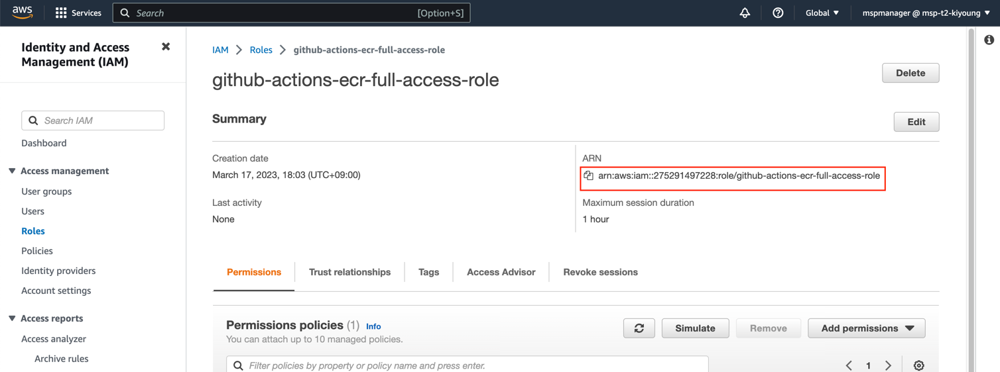

생성한 role의 arn 값을 github actions에서 사용한다.

## github actions workflow

.github/workflows 하위의 두 파일을 확인
- [api-ci.yml](api-ci.yml)
- [event-ci.yml](event-ci.yml)

workflow 실행

Actions > workflow 선택 > Run workflow

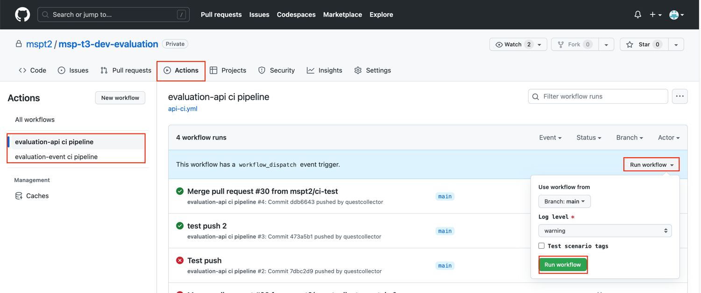