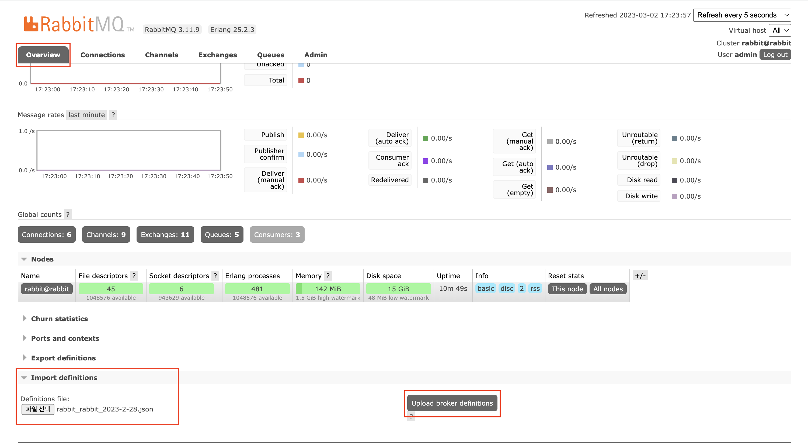

# 실습 과제 평가용 스택

## ubuntu ec2 instance

- awscli, docker, docker-compose 설치
- [`./userdata.txt`](userdata.txt)
- ecr image 권한(이미지는 아직 공유 안되어서 직접 빌드해야함)
  - `AmazonEC2ContainerRegistryReadOnly`

## init-settings.sh

환경 변수, 초기 상태에 대한 설정파일

## docker-compose.yml

docker-compose 정의 파일

## rabbitmq 라우팅 키 설정

rabbitmq 설정 JSON 파일

문의 [miroirs01@gmail.com](mailto:miroirs01@gmail.com)

## 로컬에서 실행

1. RabbitMQ와 MongoDB는 Docker compose로 구동할 수 있음
   ```shell
    docker-compose -f docker-compose-dev.yml up -d
   ```
   기동 중지 시 down 명령어 실행
   ```shell
    docker-compose -f docker-compose-dev.yml down
   ```
2. Rabbitmq config
   - JSON설정 파일을 rabbitmq management에서  
     :link: http://localhost:15672  </br>
     Overview > Import definitions 에 업로드하여 Upload broker definitions 버튼을 클릭합니다.
     </br>
   - rabbitmq 설정 JSON 파일 문의 [miroirs01@gmail.com](mailto:miroirs01@gmail.com)
   - 적용 후 logout 하고 admin 계정으로 로그인합니다.
3. evaluation-api 실행
   - 실행 시 Edit configuration을 하여 Program arguments 수정
   - Program arguments: ```--spring.profiles.active=dev```
4. evaluation-event 실행
   - 실행 시 Edit configuration을 하여 Program arguments 수정
   - Program arguments: ```--spring.profiles.active=dev```
   - environment variables: SLACK_USER_TOKEN  
     slack app token 문의 [miroirs01@gmail.com](mailto:miroirs01@gmail.com)
