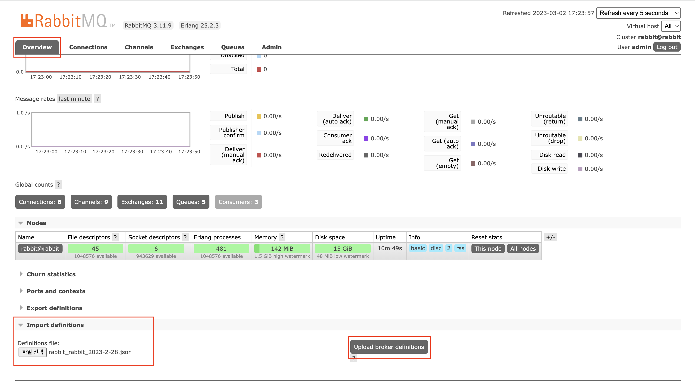

# 실습 과제 평가용 스택

## 빌드

github actions

가이드: [`.github/workflows/README.md`](.github/workflows/README.md)

api: [`.github/workflows/api-ci.yml`](.github/workflows/api-ci.yml)

event: [`.github/workflows/event-ci.yml`](.github/workflows/event-ci.yml)

## AWS 배포

msp-t3-evaluation-deploy 참조

<https://github.com/mspt2/msp-t3-dev-evaluation-deploy>

## 로컬에서 실행

[`docker-compsoe.yml`](docker-compose.yml)

1. RabbitMQ와 MongoDB는 Docker compose로 구동할 수 있음

   ```shell
    docker compose up -d
   ```

   기동 중지 시 down 명령어 실행

   ```shell
    docker compose down
   ```

2. Rabbitmq config
   - JSON설정 파일을 rabbitmq management에서  
     :link: <http://localhost:15672>  </br>
     Overview > Import definitions 에 업로드하여 Upload broker definitions 버튼을 클릭합니다.
     </br>
   - rabbitmq 설정 JSON 파일 문의 [miroirs01@gmail.com](mailto:miroirs01@gmail.com)
   - 적용 후 logout 하고 admin 계정으로 로그인합니다.
3. evaluation-api 실행
   - 실행 시 Edit configuration을 하여 Program arguments 수정
   - Program arguments: ```--spring.profiles.active=dev```
4. evaluation-event 실행
   - 실행 시 Edit configuration을 하여 Program arguments 수정
   - Program arguments: ```--spring.profiles.active=dev```
   - environment variables: SLACK_BOT_TOKEN
     slack app 만들기: <https://tall-fuel-e5e.notion.site/4-Slack-bot-fedf51dd032f4fe895d73443847115fc>

## 결과 파일 생성

experimental: POST /api/evaluation/overall/

slack에서 다운로드 받은 유저 정보 csv 파일을 입력하여 결과 파일 생성