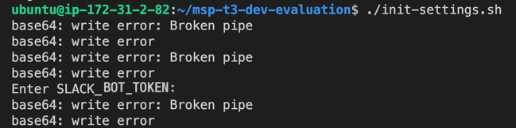

# 실습 과제 평가용 스택

## ubuntu ec2 instance

- awscli, docker설치
- [`./userdata.txt`](userdata.txt)
- ecr image 권한(이미지는 아직 공유 안되어서 직접 빌드해야함)
  - `AmazonEC2ContainerRegistryReadOnly`
- docker login
  ```bash
  aws ecr get-login-password --region us-east-1 | docker login --username AWS --password-stdin 275291497228.dkr.ecr.us-east-1.amazonaws.com
  ```
  문의 [miroirs01@gmail.com](mailto:miroirs01@gmail.com)

## Requirement

Slack app을 생성하여 SLACK_BOT_TOKEN을 이용해야 합니다.

아래 문서에서 slack app 생성 가이드를 확인할 수 있습니다. 

:link: https://tall-fuel-e5e.notion.site/4-Slack-bot-fedf51dd032f4fe895d73443847115fc

## init-settings.sh

환경 변수, 초기 상태에 대한 설정파일

docker compose 실행 전 스크립트를 실행합니다.

`Enter SLACK_BOT_TOKEN`이 나오면 입력한 후 Enter키를 입력합니다.



## docker-compose.yml

docker-compose 정의 파일

## rabbitmq 라우팅 키 설정

rabbitmq 설정 JSON 파일

문의 [miroirs01@gmail.com](mailto:miroirs01@gmail.com)

## rabbitmq cluster 구성

최대 200여개의 커넥션이 몰리는 실습 환경에서 클러스터를 굳이 설정할 필요는 없습니다.

클러스터링을 하고자 한다면 아래와 같이 할 수 있습니다.

docker-compose로 실행 후 rabbit-node1, rabbit-node2 컨테이너에 다음 명령어를 실행하여 클러스터링합니다.
```bash
docker exec -it rabbit-node1 bash
```
```bash
rabbitmqctl stop_app
rabbitmqctl join_cluster rabbit@rabbit
rabbimqctl start_app
exit
```

## 로컬에서 실행

1. RabbitMQ와 MongoDB는 Docker compose로 구동할 수 있음
   ```shell
    docker compose -f docker-compose-dev.yml up -d
   ```
   기동 중지 시 down 명령어 실행
   ```shell
    docker compose -f docker-compose-dev.yml down
   ```
2. Rabbitmq config
   - JSON설정 파일을 rabbitmq management에서  
     :link: http://localhost:15672  </br>
     Overview > Import definitions 에 업로드하여 Upload broker definitions 버튼을 클릭합니다.
     </br>
   - rabbitmq 설정 JSON 파일 문의 [miroirs01@gmail.com](mailto:miroirs01@gmail.com)
   - 적용 후 logout 하고 admin 계정으로 로그인합니다.
3. evaluation-api 실행
   - 실행 시 Edit configuration을 하여 Program arguments 수정
   - Program arguments: ```--spring.profiles.active=dev```
4. evaluation-event 실행
   - 실행 시 Edit configuration을 하여 Program arguments 수정
   - Program arguments: ```--spring.profiles.active=dev```
   - environment variables: SLACK_BOT_TOKEN  
     slack app token 문의 [miroirs01@gmail.com](mailto:miroirs01@gmail.com)

## AWS 보안 설정

1. Security group 생성 (1개당 60개 rule 입력 가능)


2. 위에서 생성 한 Security group ID에 대해 수집 된 수강생 VM IP목록으로 다음의 JSON파일 작성(최대 60개)
```json
{
    "GroupId": "sg-037c0b4976b41baf2",
    "IpPermissions": [
        {
            "IpProtocol": "tcp",
            "FromPort": 5672,
            "ToPort": 5672,
            "IpRanges": [
                {"CidrIp": "121.133.133.0/24"},
                {"CidrIp": "221.167.219.0/24"}
            ]
        }
    ]
}

```

3. AWS CLI에서 다음의 명령어 수행
```shell
aws ec2 authorize-security-group-ingress --cli-input-json file://./windows-vm-sg.json
```